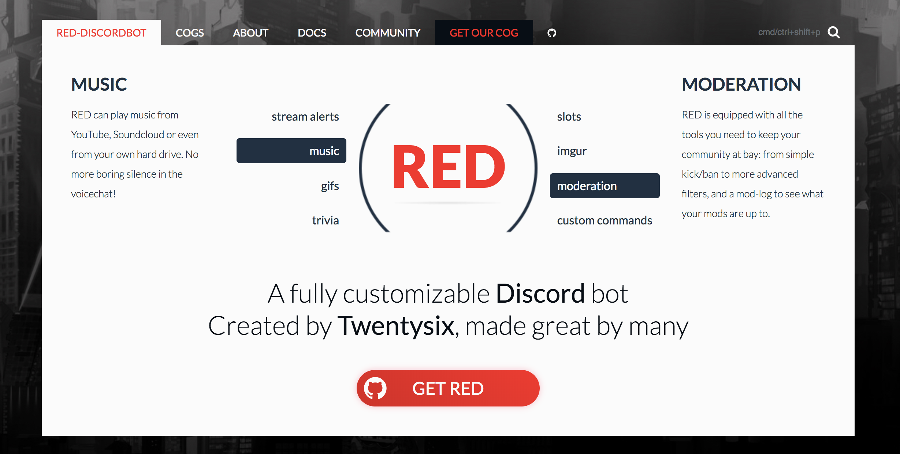
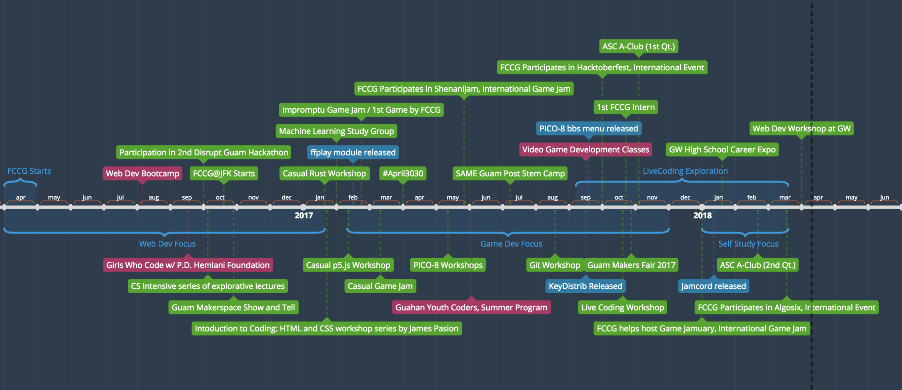
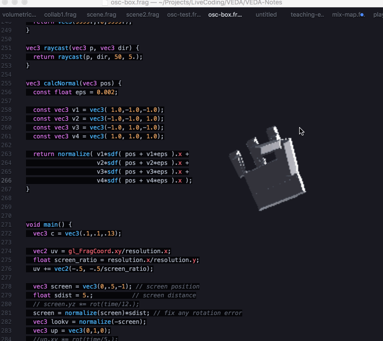
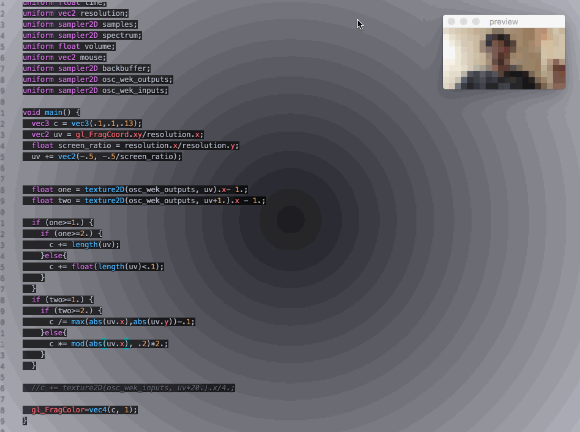

## Brief Portfolio

I enjoy programming. I spend a lot of time in my code.  
I also enjoy art and music and try to find ways to incorporate those into my projects.

Community engagement is my other passion, so since I've found my way into Open Source communities, I've been making roughly [1000 contributions yearly](https://github.com/Chovin).  

Here are some of the things I've been up to recently in my free time.

### Projects

#### Red-DiscordBot

**[Red-DiscordBot](https://github.com/Cog-Creators/Red-DiscordBot)**: a modular chatbot for the popular gaming chat platform Discord.   
**Lang**: Python  
**Userbase**: 350,000+ users across official servers including Rocket League, Fortnite, and Clash Royale.  
**Community**: 450+ module contributions by the community.  
**Title**: Part Owner and Core Developer

Module Contributions:  

+ Community Engagement Centered: 
    * [Welcome](https://cogs.red/cogs/irdumbs/Dumb-Cogs/welcome/)
    * [Adventure port](https://cogs.red/cogs/irdumbs/Dumb-Cogs/adventure/)
    * [Snacktime](https://cogs.red/cogs/irdumbs/Dumb-Cogs/snacktime/) 
    * [EconomyTrickle](https://cogs.red/cogs/irdumbs/Dumb-Cogs/economytrickle/)
+ Tools
    * [REPL fork](https://cogs.red/cogs/irdumbs/Dumb-Cogs/repl/)
    * [keydistrib - key manager](https://cogs.red/cogs/FreeCodeCampGuam/FCCG-Cogs/keydistrib/) (project manager)
        - used in FCCG Bootcamp + server
+ Entertainment / Misc
    * [pico8 - bbs search](https://cogs.red/cogs/FreeCodeCampGuam/FCCG-Cogs/pico8/)
    * [ffplay - local media player](https://cogs.red/cogs/FreeCodeCampGuam/FCCG-Cogs/ffplay/)
        - used at FCCG Bootcamps
    * [Jamcord - collaborative window into livecoding](https://cogs.red/cogs/FreeCodeCampGuam/FCCG-Cogs/jamcord/)
        - used at various events including [Algosix](https://algorave.com/wearesix/). ([clip of usage](https://youtu.be/bvDa0MHIK2c?t=20m35s))

#### FreeCodeCamp Guam

In an effort to grow programming skills on our island, with support from many wonderful sponsors, I've taken on leadership of FreeCodeCamp Guam in an effort to turn it into a community of learning and support for those brave enough to explore the creative power that is programming.

The following lists most of the events and projects we've done as a group.

**Member Stories**:

* After FCCG bootcamp, an individual gets job at ISP, automates it, and gets promoted within 6 months.
* FCCG helps place another individual in an internship position. Year later becomes software engineer at Uber.
* A student's requests to join research projects are declined for 2 years. After becoming a FCCG intern, gets accepted to 2 Machine Learning research projects.

**Projects along the way**:

* [Web Dev Bootcamp Leaderboard](https://fccg-leaderboard.herokuapp.com/tributes.html?v=0.1.3) (not maintained)  
   (JavaScript/Python)
* [Game Jam / Bootcamp Games](https://fccguam.itch.io/)  
(JavaScript/Lua)
    - [Litghsaber](https://www.lexaloffle.com/bbs/?tid=30137) now has [iOS Gyro control](https://github.com/Chovin/Litghtsaber/tree/osc-gpio)  
    (Node/Lua)
* [GLSL Explorations](https://github.com/Chovin/VEDA-Notes)  
(GLSL/Python)
    -   
    iOS Gyro controlled hand
    -   
    Machine Learning / Computer Vision Classification 
    -   
    Reflections / Refractions 
